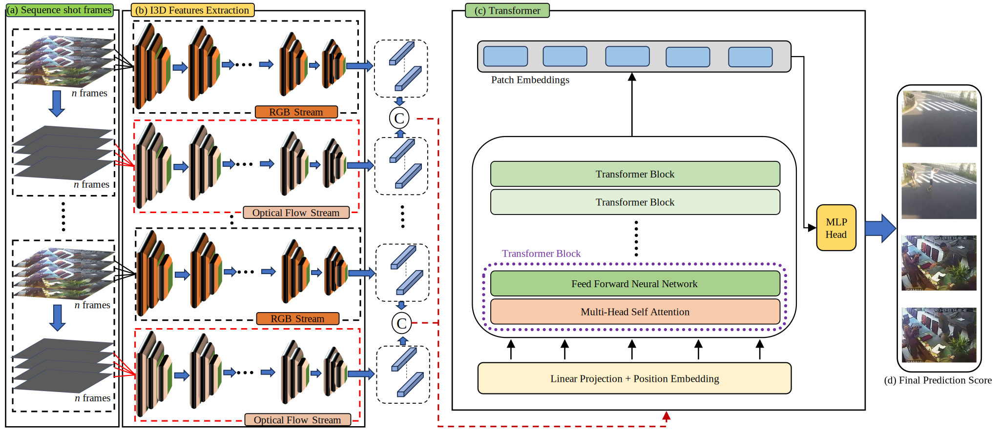

## TDS-Net: Transformer enhanced dual-stream network for video Anomaly Detection

This paper has been published in [Expert Systems with Applications.](https://www.sciencedirect.com/journal/expert-systems-with-applications) 

### 1. The Proposed Framework
Video anomaly detection is a critical research area, driven by the increasing reliance on surveillance systems to maintain public safety and security. The implementation of surveillance cameras in public spaces is driven by the specific goal of monitoring incidents involving theft, vandalism, traffic accidents, etc. However, the reliance on human oversight for anomaly detection introduces a susceptibility to errors, emphasizing the urgent need for the development of efficient algorithms capable of autonomously detecting anomalies in video footage. Furthermore, anomalous patterns within video data often have a complex background, unexpected events, variations in the scale of the objects, and anomalous appearances, which makes their detection challenging. Therefore we introduce a novel Dual Stream Transformer Network (TDS-Net) to address these challenges. TDSNet concurrently extracts RGB and flow features, using a transformer network for sequential pattern learning. The parallel extraction of RGB features allows the model to learn patterns, while the dedicated flow module adeptly handles motion features. The significance of this innovative network for video anomaly detection is that it enhances the ability to identify and analyze unusual patterns or events within video data. Furthermore, the TDS-Net has demonstrated superior accuracy compared to baseline methods across benchmark datasets, including ShanghaiTech, CUHK Avenue, and UCF Crime. On the UCF Crime dataset, our method demonstrated superior performance with an AUC of 84.5%, surpassing the latest state-of-the-art technique, with a 0.65% margin. Similarly, on the CUHK Avenue and ShanghaiTech datasets, our approach excels with a notable AUC of 90%, and 94.7% respectively, outperforming the latest SOTA methods. We also carried out an ablation study, offering insights into the individual contributions of the components of the TDS-Net architecture.

*The proposed framework:* Illustration of the overall flow of the TDS-Net method, (a) Sequence shot frames ; (b) I3D features extraction; (c) Transformer block; (d) Final output.

### 2. Datasets
The datasets can be downloaded from the following links.

Option 1: Download UCF-Crime dataset from given link: [Click here](https://openaccess.thecvf.com/content_cvpr_2018/html/Sultani_Real-World_Anomaly_Detection_CVPR_2018_paper.html)

Option 2: Download CUHK Avenue dataset from given link: [Click here](https://www.cv-foundation.org/openaccess/content_iccv_2013/html/Lu_Abnormal_Event_Detection_2013_ICCV_paper.html) 

Option 3: Download ShanghaiTech dataset from given link: [Click here](https://openaccess.thecvf.com/content_CVPR_2019/html/Zhong_Graph_Convolutional_Label_Noise_Cleaner_Train_a_Plug-And-Play_Action_Classifier_CVPR_2019_paper.html)

## 3. Acknowledgements
This work was supported by the National Research Foundation of Korea (NRF), a grant funded by the Korea government (MSIT), Grant/Award Number: (2023R1A2C1005788).
